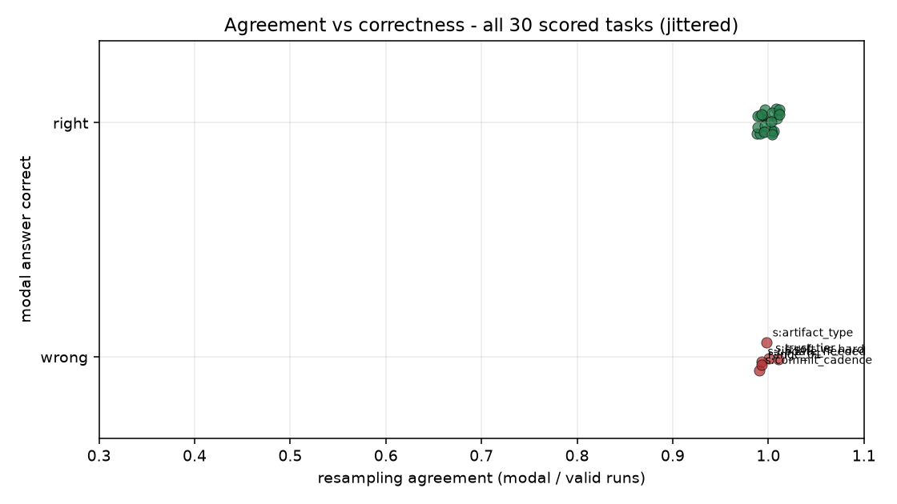
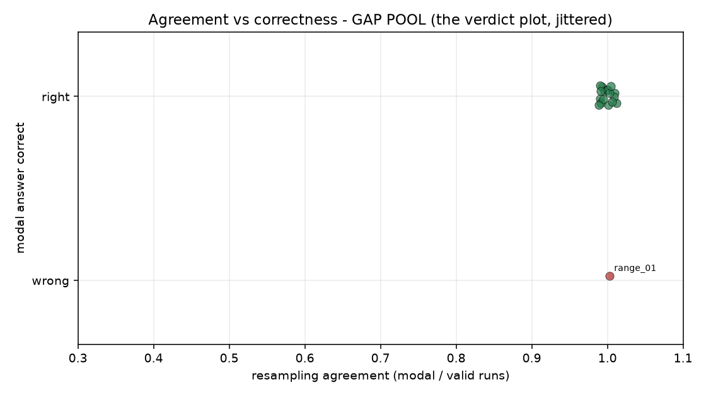

# Confidence experiment — analysis (results_real.json)

Capture: 31 tasks x 7 runs, model `claude-sonnet-4-6`. Analysis is API-free; results_real.json stays gitignored. Read this against the gate language in [`MANIFEST_HEADER.md`](MANIFEST_HEADER.md).

## Routing re-extraction (fix-forward)

The verbatim raw responses settle the failure mode: it is **token-budget truncation, not extraction tolerance**. On the routing tasks the model ignored the one-word instruction, opened with analysis prose, and was cut off by `MAX_TOKENS = 64` before ever stating a value — those runs genuinely contain no enum value, so they drop from the agreement denominator rather than being guessed. One further run (gap_route_02 run 1) was a transient API 529 Overloaded error, captured by the harness's fail-soft error handling and likewise dropped. **Limitations for any future capture:** (a) one-word-answer prompts need a larger token budget or stricter format forcing for tasks that invite reasoning; (b) tolerant extraction (normalization + labeled-phrase detection) belongs in the harness. The proven harness was not edited; this is fixed forward here.

- `gap_route_01`: recovered 1/7 runs -> ['infrastructure-fix'] — 6 run(s) genuinely unparseable, dropped from denominator
- `gap_route_02`: recovered 6/7 runs -> ['doc-fix', 'doc-fix', 'doc-fix', 'doc-fix', 'doc-fix', 'doc-fix'] — 1 run(s) genuinely unparseable, dropped from denominator
- `gap_route_03`: recovered 0/7 runs -> [] — UNSCOREABLE - zero valid runs; excluded from scoring

**Unscoreable (1):** `gap_route_03` — zero valid runs; excluded from all scoring below (scored set = 30/31).

## Per-task table

| task_id | class | difficulty | source | n_valid | modal | agreement | truth | correct | chance floor |
|---|---|---|---|---|---|---|---|---|---|
| ctrl_typecheck_valid | control | - | real | 7 | TYPE_OK | 1.000 | TYPE_OK | Y | 0.656 |
| ctrl_typecheck_invalid | control | - | real | 7 | TYPE_ERROR | 1.000 | TYPE_ERROR | Y | 0.656 |
| ctrl_test_pass | control | - | real | 7 | PASS | 1.000 | PASS | Y | 0.656 |
| ctrl_test_fail | control | - | real | 7 | FAIL | 1.000 | FAIL | Y | 0.656 |
| ctrl_syntax_valid | control | - | real | 7 | VALID | 1.000 | VALID | Y | 0.656 |
| ctrl_syntax_invalid | control | - | real | 7 | INVALID | 1.000 | INVALID | Y | 0.656 |
| stress_trust_tier | stress | - | real | 7 | 2 | 1.000 | 3 | N | 0.410 |
| stress_artifact_type | stress | - | real | 7 | skill | 1.000 | script | N | 0.328 |
| stress_commit_cadence | stress | - | real | 7 | SINGLE | 1.000 | THREE | N | 0.525 |
| stress_soft_vs_hard | stress | - | real | 7 | SOFT | 1.000 | HARD | N | 0.656 |
| stress_update_needed | stress | - | real | 7 | NO | 1.000 | YES | N | 0.656 |
| gap_baseline_task_watchdog_01 | gap | easy | real | 7 | UNCHANGED | 1.000 | UNCHANGED | Y | 0.656 |
| gap_range_01 | gap | easy | real | 7 | NO | 1.000 | YES | N | 0.656 |
| gap_range_02 | gap | ambiguous | real | 7 | NO | 1.000 | NO | Y | 0.656 |
| gap_range_03 | gap | ambiguous | real | 7 | YES | 1.000 | YES | Y | 0.656 |
| gap_range_04 | gap | ambiguous | real | 7 | NO | 1.000 | NO | Y | 0.656 |
| gap_range_05 | gap | ambiguous | real | 7 | NO | 1.000 | NO | Y | 0.656 |
| gap_prop_01 | gap | easy | real | 7 | NO | 1.000 | NO | Y | 0.656 |
| gap_prop_02 | gap | ambiguous | real | 7 | YES | 1.000 | YES | Y | 0.656 |
| gap_prop_03 | gap | ambiguous | real | 7 | YES | 1.000 | YES | Y | 0.656 |
| gap_prop_04 | gap | ambiguous | real | 7 | NO | 1.000 | NO | Y | 0.656 |
| gap_prop_05 | gap | ambiguous | real | 7 | NO | 1.000 | NO | Y | 0.656 |
| gap_route_01 | gap | easy | real | 1 | infrastructure-fix | 1.000 | infrastructure-fix | Y | 0.328 |
| gap_route_02 | gap | ambiguous | real | 6 | doc-fix | 1.000 | doc-fix | Y | 0.328 |
| gap_route_03 | gap | easy | synthetic | 0 | - | - | manual_action | - | 0.328 |
| gap_mirror_01 | gap | ambiguous | real | 7 | DRIFTED | 1.000 | DRIFTED | Y | 0.525 |
| gap_mirror_02 | gap | easy | real | 7 | NO_MIRROR | 1.000 | NO_MIRROR | Y | 0.525 |
| gap_file_02 | gap | easy | real | 7 | UNCHANGED | 1.000 | UNCHANGED | Y | 0.656 |
| gap_file_03 | gap | easy | real | 7 | MODIFIED | 1.000 | MODIFIED | Y | 0.656 |
| gap_file_04 | gap | ambiguous | synthetic | 7 | MODIFIED | 1.000 | MODIFIED | Y | 0.656 |
| gap_file_05 | gap | ambiguous | synthetic | 7 | MODIFIED | 1.000 | MODIFIED | Y | 0.656 |

Chance floor = exact E[modal count]/N for uniform answers at N=7 (k=2: 0.651, k=3: 0.527, k=5: 0.423, k=9: 0.345). Agreement at or below the floor carries no signal.

## Accuracy

Overall: **24/30 (80.0%)**

- by task_class: control 6/6 · gap 18/19 · stress 0/5
- by difficulty: - 6/11 · ambiguous 12/12 · easy 6/7
- by source: real 22/28 · synthetic 2/2
- by framing: artifact_routing 0/1 · commit_cadence 0/1 · gate_classification 0/1 · git_range_reasoning 4/5 · mirror_state 2/2 · observation_routing 2/2 · operation_tier 0/1 · propagation_reasoning 5/5 · syntax 2/2 · test_outcome 2/2 · two_contents_comparison 5/5 · typecheck 2/2 · update_propagation 0/1

## Variance

Agreement distribution: {'1.000': 30} — mean 1.000, pstdev 0.000.

**The signal has no variance on this distribution and therefore cannot discriminate correctness here.**

Confidently-wrong list (agreement >= 6/7, modal wrong) — the decisive evidence (6):

- `stress_trust_tier` — agreement 1.000, modal `2`, truth `3` (-, operation_tier)
- `stress_artifact_type` — agreement 1.000, modal `skill`, truth `script` (-, artifact_routing)
- `stress_commit_cadence` — agreement 1.000, modal `SINGLE`, truth `THREE` (-, commit_cadence)
- `stress_soft_vs_hard` — agreement 1.000, modal `SOFT`, truth `HARD` (-, gate_classification)
- `stress_update_needed` — agreement 1.000, modal `NO`, truth `YES` (-, update_propagation)
- `gap_range_01` — agreement 1.000, modal `NO`, truth `YES` (easy, git_range_reasoning)

## Minimum-N

No task's correct/incorrect verdict differs at N=3 or N=5 vs N=7 — the verdicts are settled by the third run everywhere.

## Plots

## Verdict (against the pre-committed gate)

> A clean structured result means: the signal CAN exist — proceed to a prose stress-test. It does NOT mean: build the engine. The prose stress-test is the next gate, not an optional follow-up.

**Branch supported by the data: RED.** Agreement is ~constant (pstdev 0.000) - no variance to discriminate with; 6 task(s) are confidently wrong at >=6/7 agreement.

